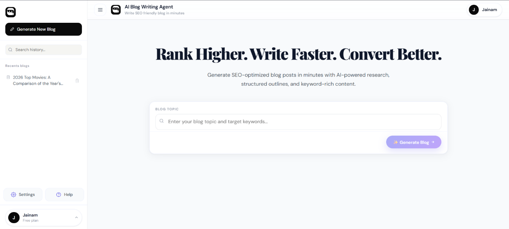

# AI Blog Writing Agent

An AI-powered blog generation platform that automates the complete blog writing workflow using intelligent AI agents, SEO optimization, and automation pipelines.

The platform helps users generate high-quality, SEO-friendly blogs in minutes by combining AI research, structured content planning, and automated content generation.

---

# Features

* AI-powered blog generation
* SEO optimized content creation
* Automated research and planning
* Multi-agent AI workflow
* Blog regeneration
* Authentication system
* Chat history management
* PDF/Word export
* Workflow automation using n8n
* Responsive modern UI

---

# Tech Stack

## Frontend

* React.js
* TypeScript

## Backend

* Python
* FastAPI

## Database

* PostgreSQL

## AI & Automation

* LangChain
* LangGraph
* Groq API
* n8n

---

# Project Overview

This project was built to simplify and automate content creation using AI-powered workflows. The application combines modern frontend technologies, backend APIs, and AI orchestration to generate SEO-friendly blogs efficiently.

The system supports intelligent research, structured blog generation, backend workflow automation, and scalable AI integration while maintaining a clean and user-friendly experience.

---

# Demo Screenshots

## Home Page

---

## Sign In Page

---

## Generated Blog Output

---

# Future Improvements

* AI image generation
* Multi-language support
* Advanced SEO scoring
* Cloud deployment
* Team collaboration features
